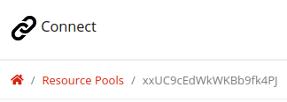

# Connect Webview
This is an example of how to build a page for Connect.

Click [here](https://hapi-robo.github.io/connect-webview/) to see the example in your web-browser. Note, however, that some features may not work unless running from Connect.

## Usage
Fork this repository (or select `Use this template`) and [host directly on GitHub](https://pages.github.com/).

### Resource Pools
Add your `RESOURCE_POOL_ID` [here](https://github.com/hapi-robo/connect-webview/blob/616819f61c11d6d71c1a71421a0bfcb1a0140dfd/js/resource-pool.js#L1). You can find your resource pool ID in the Connect webapp under `Resource Pools`.

In the example below, the resource pool ID is `xxUC9cEdWkWKBb9fk4PJ`.



## API
This is a list of all APIs that are available.

Description | API
--- | ---
Call resource pool | [connect.call()](#connectcall)
Resource pool status listener | [connect.addResourcePoolStatusListener()](#connectaddResourcePoolStatusListener)
Go to a saved location | [connect.gotoLocation()](#connectgotolocation)
Get saved locations | [connect.getLocations()](#connectgetlocations)
Command robot to turn its mobile base | [connect.turnBy()](#connectturnby)
Command robot to tilt its screen | [connect.tiltBy()](#connecttiltby)
Text-to-speech request | [connect.speak()](#connectspeak)

---
### connect.call()
The method `connect.call()` initiates a call to an available operator of a resource pool.

#### Syntax
```javascript
connect.call(resourcePoolId);
```

#### Parameters
`resourcePoolId`: A resource pool's unique identifier `String`.

#### Return value
`undefined`

#### Example
HTML
```html
<button type="button" id="button-call">Call</button>
```

JavaScript
```javascript
const buttonCall = document.querySelector('#button-call');
buttonCall.addEventListener('click', () => {
  connect.call(resourcePoolId);
});
```

---
### connect.addResourcePoolStatusListener()
The method `connect.addResourcePoolStatusListener()` sets up a function that will be called whenever the status of the resource pool changes.

#### Syntax
```javascript
connect.addResourcePoolStatusListener(listener, resourcePoolId);
```

#### Parameters
`listener`: A `String` name of the JavaScript function that receives a notification when the status of the resource pool changes. The function must have `availableOperators` as an argument, which indicates the number of operators in a resource pool that are currently available.

`resourcePoolId`: A resource pool's unique identifier `String`.

#### Return value
`undefined`

#### Example
HTML
```html
<h1 id="status"></h1>
```

JavaScript
```javascript
// Status listener
const operatorStatus = document.querySelector('#status');
function onResourcePoolStatusChange(availableOperators) {
  operatorStatus.innerHTML = `Available Operators: ${availableOperators}`;
}

// Register status listener
connect.addResourcePoolStatusListener('onResourcePoolStatusChange', resourcePoolId);
```

---
### connect.gotoLocation()
The method `connect.gotoLocation()` commands the robot to go to a predefined location.

#### Syntax
```javascript
connect.gotoLocation(locationName);
```

#### Parameters
`locationName`: A location name `String`.

#### Return value
`undefined`

#### Example
JavaScript
```javascript
connect.goto('home base');
```

---
### connect.getLocations()
The method `connect.getLocations()` a list of all saved locations.

#### Syntax
```javascript
connect.getLocations();
```

#### Parameters
`none`

#### Return value
`locationList`: A `String` `List` of all saved locations

#### Example
HTML
```html
<select id="location-list"></select> 
```

JavaScript
```javascript
const locations = JSON.parse(connect.getLocations());

const locationList = document.querySelector('#location-list');
locations.forEach((location) => {
  const option = document.createElement('option');
  option.innerHTML = location;
  locationList.appendChild(option);
});
```

---
### connect.turnBy()
The method `connect.turnBy()` commands the robot to rotate its mobile base by the given angle.

#### Syntax
```javascript
connect.turnBy(angle);
```

#### Parameters
`angle`: Relative `int` angle (degrees) by which to turn. A positive value turns to the left. A negative value turns to the right.

#### Return value
`undefined`

#### Example
JavaScript
```javascript
connect.turnBy(+90); // turn 90 degrees to the left
connect.turnBy(-90); // turn 90 degrees to the right
```

---
### connect.tiltBy()
The method `connect.tiltBy()` commands the robot to tilt its screen by the given angle.

#### Syntax
```javascript
connect.tiltBy(angle);
```

#### Parameters
`angle`: Relative `int` angle (degrees) by which to tilt. A positive value tilts the screen upwards. A negative value tilts the screen downwards. Values can range between -25 to +55 degrees.

#### Return value
`undefined`

#### Example
JavaScript
```javascript
connect.tiltBy(+55); // tilt the screen all the way up
connect.tiltBy(-25); // tilt the screen all the way down
```

---
### connect.speak()
The method `connect.speak()` takes text and synthesizes speech (i.e. text-to-speech, or TTS) that is played out over the device's speaker.

#### Syntax
```javascript
connect.speak(text);
```

#### Parameters
`text`: Text `String` to send to the speech synthesizer.

#### Return value
`undefined`

#### Example
JavaScript
```javascript
connect.speak("Hello world!");
```

